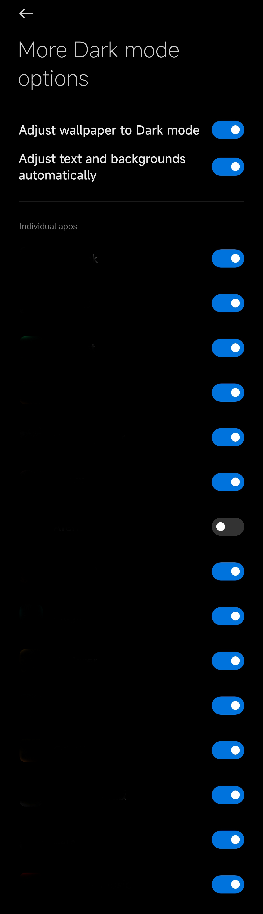

# ForceDarkModeForMIUI

## 背景

因为某些原因，在某个版本后，MIUI只允许少部分白名单内的应用开启深色模式，大部分的应用都无法开启。如下图所示（图片来自酷安@yjq12138）：


为此，本项目在上图所示的设置项中添加了本机已安装的其他应用，允许用户为其他应用开启深色模式。效果如下所示（为保护个人隐私，已将具体应用打码）：



## 安装

### 免责声明

！！！因实现上述功能需要修改系统文件，这可能会导致您的手机无法开机甚至出现硬件损坏。如果您仍执行后续操作，代表您知悉并同意该项目的风险。如果您在操作中出现上述问题，本人以及代码托管平台不承担任何责任。如不同意，请不要执行后续操作。

### 前提

* MIUI3（MIUI12.5未测试）
* 手机已获得ROOT权限
* 手机上安装终端软件，例如ATerm

### 步骤

1. 下载`ForceDarkModeForMIUI.sh`

2. 打开终端软件，授予ROOT权限，进入`ForceDarkModeForMIUI.sh`所在目录。

3. 挂载根目录

   ``` shell
   su
   
   mount -o rw,remount /
   ```

4. 移动`ForceDarkModeForMIUI.sh`到`/system/etc`。

   ```shell
   mv  ForceDarkModeForMIUI.sh  /system/etc
   ```

5. 给该脚本添加执行权限并执行

   ``` shell
   cd /system/etc
   
   chmod 755 ForceDarkModeForMIUI.sh
   
   ./ForceDarkModeForMIUI.sh
   ```

6. 重启手机，打开设置，现在可以打开其他应用的深色模式啦。

### 注意

在安装新的应用后，深色模式的设置中不会自动添加该应用。需要再次执行该脚本并重启手机。